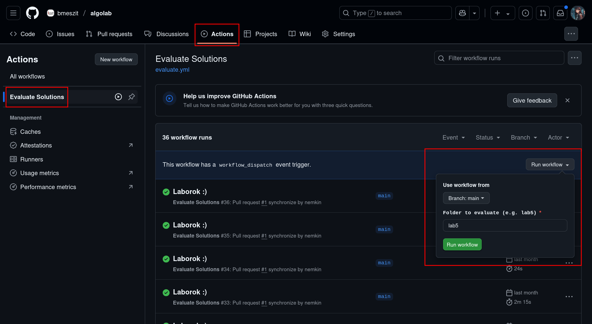

# Algolab

## Tervezett menetrend

A későbbi témakörök képlékenyek, erősen attól függenek, hogy a korábbi laborokon hogyan haladtunk, hogy sikerültek a házik.

| Labor | Dátum            | Terv                                              |
| ----- | ---------------- | ------------------------------------------------- |
| Lab1  | 2025\. 02\. 12\. | Rekurziók, keresés, rendezés                      |
| Lab2  | 2025\. 02\. 26\. | Gráfalgoritmusok: BFS, DFS, Euler-ks, Dijkstra    |
| Lab3  | 2025\. 03\. 12\. | DSU, Kruskal, Párosítások                         |
| Lab4  | 2025\. 03\. 26\. | Stabil párosítások, közlekedőedények, szavazás    |
| Lab5  | 2025\. 04\. 09\. | Lakáspiaci újraelosztások, TTC, egyensúlyi árazás |
| Lab6  | 2025\. 04\. 30\. | Találjunk ki HEX stratégiákat                     |
| Lab7  | 2025\. 05\. 14\. | Meghívott előadás (?)                             |

## Pontozás

- Összesen 6 laboralkalom van, ezekre függetlenül kaptok egy-egy jegyet, továbbá legfeljebb 20-30 extra pontot.
- A legrosszabbul sikerült labort nem vesszük figyelembe, ez akár nem teljesített is lehet.
- Az 5 laborra kapott jegy átlaga az év végi jegy.
- Az 5 laborra kapott extra pontok átlaga, de legfeljebb 15 pont az IMSC pont. Tehát *nem* skálázzuk le 15-re, túl lehet teljesíteni a maximumot.
- Az utolsó, 7. laboralkalomra vendégelőadást próbálok szervezni, az már csak kikapcsolódás lesz, házik nélkül.

## Programozási feladatok

- C++ vagy Python nyelven oldhatók meg.
- A tesztesetek megoldásokkal együtt publikusak, ez nektek segítség.
  - A programkódot el fogom olvasni, ha nem általános, pl. bemenet string matchre az ismert kimenet string kiírása, akkor 0 pont. :)
- Tesztesetenként a limitek:
  - Idő: 5 mp, Memória: 512 MB
  - Ezek kicsit megengedőbbek a feladat forrásokhoz képest.

### Tesztelés

Verdictek:

- OK
- WA = Wrong Answer
- TLE = Time Limit Exceeded
- MLE = Memory Limit Exceeded
- RE = Runtime Error
  - Jelenleg, ha a time/memory limit 2x-esét meghaladja, akkor is RE, de ezt próbálom javítani.

### Tesztelő futtatása

Lehet egy egész mappát, vagy a feladat mappájának a gyökerében lévő fájlt tesztelni (lásd a lenti példákat). Konkrét fájlnál az a fontos, hogy csak azt a könyvtárat nézi végig teszteseteket keresve rekurzívan, amiben a fájl található.

### Windowson

Docker telepítése után, a repó root-jában kiadva PowerShell-ből:
```powershell
$env:TARGET="lab5"; docker-compose up
$env:TARGET="lab5/ora1-ttc"; docker-compose up
$env:TARGET="lab5/ora1-ttc/megoldasom.cpp"; docker-compose up
$env:TARGET="lab5/ora1-ttc/ttc.py"; docker-compose up
```

### Linuxon

Függőségek telepítése (Debian-alapú Linuxokon):
```bash
sudo apt install time bc git build-essential python3 python-is-python3
```

Futtatás példák:
```bash
./eval.sh lab5
./eval.sh lab5/ora1-ttc
./eval.sh lab5/ora1-ttc/megoldasom.cpp
./eval.sh lab5/ora1-ttc/ttc.py
```

Vagy akár Dockerrel, annak a telepítése után, a repó root-jában kiadva:
```bash
TARGET=lab5 sudo -E docker compose up
TARGET=lab5/ora1-ttc sudo -E docker compose up
TARGET=lab5/ora1-ttc/megoldasom.cpp sudo -E docker compose up
TARGET=lab5/ora1-ttc/ttc.py sudo -E docker compose up
```

### Githubon

A pull requestben mindig le fog futni az adott labor mappájára az `eval.sh`, ha feltöltötök a `main` branchre valamit.

Ezen felül bármelyik branchen futtatható az Evaluate Solutions action (Github Actions tabon):



## Források

A feladatok forrásai a következő weboldalak:

- [CSES](https://cses.fi/problemset)
- [Codeforces](https://codeforces.com)
- [LeetCode](https://leetcode.com)
