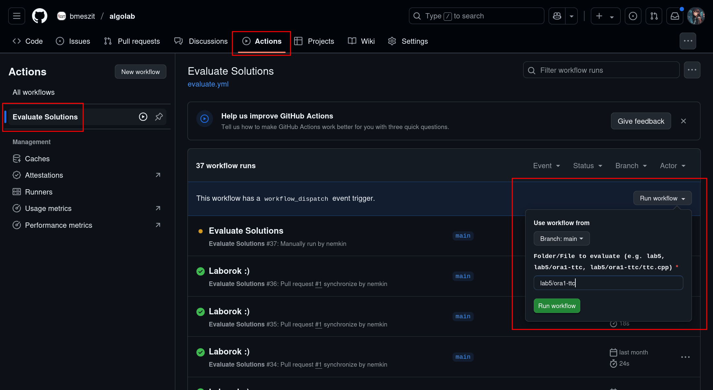

# Tesztelő script

- Az `eval.sh` scripttel lehet egy egész mappát, vagy a feladat mappájának a gyökerében lévő fájlt tesztelni (lásd a lenti példákat).
  - A script az adott mappában lévő összes `.py`, illetve `.cpp` fájlt leteszteli, az adott fájlhoz tartozó mappában lévő tesztesetekre.
    - Ezért a kódfájlt a feladat mappájába kell tenni, a kiírást tartalmazó `README.md` mellé.
- Több lehetséges megoldás esetén:
  - Sok feladat esetében a megoldás egyértelmű, azonban akad bőven olyan is, ahol több lehetséges jó megoldás van, például egy maximális párosítás megtalálása a gráfban.
  - Ilyenkor az általam írt `feladat/tesztek/tester.cpp` program ellenőrzi algoritmikusan a kiírt megoldás helyességét, a hivatalos megoldás alapján.
  - Például egy párosítás maximalitását a hivatalos megoldással összevetve, az élek létezését és függetlenségét pedig algoritmikusan ellenőrzi.
    - Általában figyelek rá, hogy a megoldás maga ne legyen része a tesztelő algoritmusnak. :)

## Tesztelés lokálisan

### Windowson

Docker telepítése után, a repó root-jában kiadva PowerShell-ből.

Futtatás példák:
```powershell
# Konkrét c++ fájl tesztelése:
$env:TARGET="lab5/ora1-ttc/megoldasom.cpp"; docker-compose up
# Konrkét py fájl tesztelése:
$env:TARGET="lab5/ora1-ttc/ttc.py"; docker-compose up
# Egy adott feladatra beadott összes megoldás tesztelése:
$env:TARGET="lab5/ora1-ttc"; docker-compose up
# Az egész labor összes feladatára beadott összes megoldás tesztelése:
$env:TARGET="lab5"; docker-compose up
```

### Linuxon

Függőségek telepítése (Debian-alapú Linuxokon):
```bash
sudo apt install time bc git build-essential python3 python-is-python3
```

Futtatás példák:
```bash
# Konkrét c++ fájl tesztelése:
./eval.sh lab5/ora1-ttc/megoldasom.cpp
# Konrkét py fájl tesztelése:
./eval.sh lab5/ora1-ttc/ttc.py
# Egy adott feladatra beadott összes megoldás tesztelése:
./eval.sh lab5/ora1-ttc
# Az egész labor összes feladatára beadott összes megoldás tesztelése:
./eval.sh lab5
```

Vagy akár Dockerrel, annak a telepítése után, a repó root-jában kiadva:
```bash
# Konkrét c++ fájl tesztelése:
TARGET=lab5/ora1-ttc/megoldasom.cpp sudo -E docker compose up
# Konrkét py fájl tesztelése:
TARGET=lab5/ora1-ttc/ttc.py sudo -E docker compose up
# Egy adott feladatra beadott összes megoldás tesztelése:
TARGET=lab5/ora1-ttc sudo -E docker compose up
# Az egész labor összes feladatára beadott összes megoldás tesztelése:
TARGET=lab5 sudo -E docker compose up
```

## Tesztelés Githubon

- A pull requestben mindig le fog futni az adott labor mappájára az `eval.sh`, ha feltöltötök a `main` branchre valamit.
- Ezen felül bármelyik branchen futtatható az Evaluate Solutions action (Github Actions tabon):


