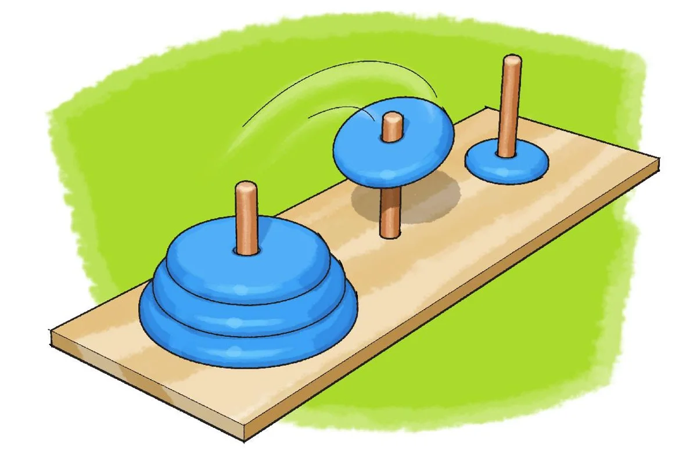

# Hanoi tornyai [PROG]



A Hanoi tornyai játék három (bal, középső és jobb) rúdból és $n$ különböző méretű kerek korongból áll. Kezdetben a bal rúdon van az összes korong, méretük szerint növekvő sorrendben, felülről lefelé haladva.

A cél az, hogy az összes korongot a jobb rúdra helyezzük. Minden mozgatásnál az egyik rúdon a legfelső korongot egy másik rúdra lehet áthelyezni, viszont nagyobb korongot kisebb korong tetejére nem szabad rakni.

A feladat a minimális lépésszámú megoldás megtalálása és a mozgatási instrukciók kiírása a kimenetre (lásd példa).

## Bemenet

Az egyetlen bemeneti sorban egy egész szám van, $n$ a lemezek száma, $1 \le n \le 16$.

## Kimenet

Az első sorba a $k$-t, a minimális mozgatások számát kell kiírni.  
A rákövetkező $k$ sor mindegyikében egy lépés leírása legyen, vagyis egy $a$ és egy $b$ egész szám, ami azt jelenti, hogy az $a$. rúd aktuális felső korongját a $b$. rúdra mozgatjuk. A rudak sorszámozása: $1$=bal, $2$=középső, $3$=jobb.

## Példák

Bemenet:
```
2
```

Kimenet:
```
3
1 2
1 3
2 3
```

## Megjegyzések

- Először gondoljuk végig elméletben, kinek milyen ötlete van?
- Az ötleteket mennyire könnyű átlátni, indokolni, implementálni?
- Ha túl bonyolult érvelni, lehet érdemes tovább gondolkozni...
- Ha megvan a jó gondolat, programozzuk le!
