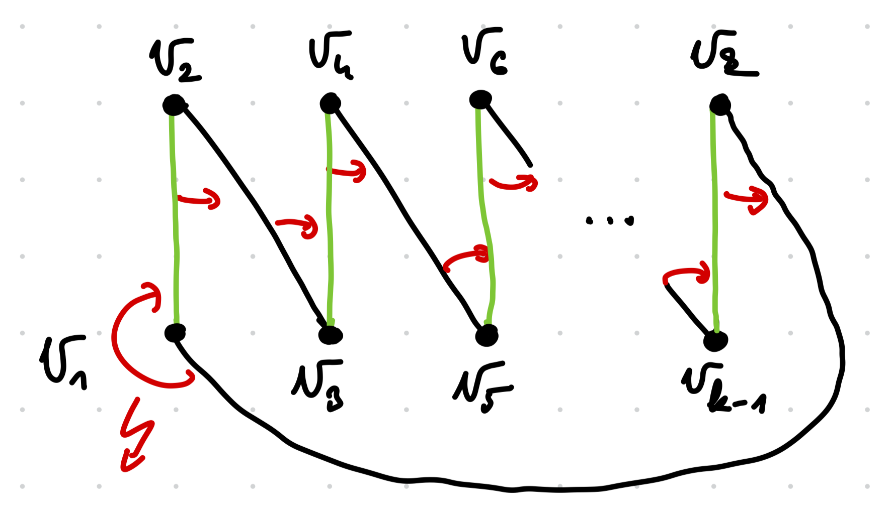

# Horoszkóp

Biztosan van legalább egy stabil párosítás, hiszen a lánykérő algoritmust futtatva
az adott bemenetre fogunk egyet találni.

Állítás: Biztosan nincs kettő vagy több páronként különböző stabil párosítás,
hiszen ha lenne két különböző, akkor:

- Ezek szimmetrikus különbsége diszjunkt köröket alkot, legyenek az egyik ilyen kör csúcsai sorban $v_1, v_2, \dots, v_k$. Legyen az egyik párosítás a zöld, a másik a fekete élű:

- Piros nyilak: Tegyük fel, hogy $v_2$ számára $v_3 \succcurlyeq v_1$, ekkor viszont a zöld párosítás stabilitása miatt $v_3$ számára pedig $v_4 \succcurlyeq v_2 $.
- Ezt a gondolatmenetet továbbfolytatva körbeérhetünk a körön.
- Viszont ez ellentmondás, hiszen az egyéni preferenciasorrendeket az élekre vonatkozó globális sorrendből származtattuk, ennek pedig tranzitívnak kellene lennie, emiatt például a $(v_1, v_2)$ élnek egyszerre jobbnak és rosszabnak is kellene lennie a $(v_k, v_1)$ élhez képest.
