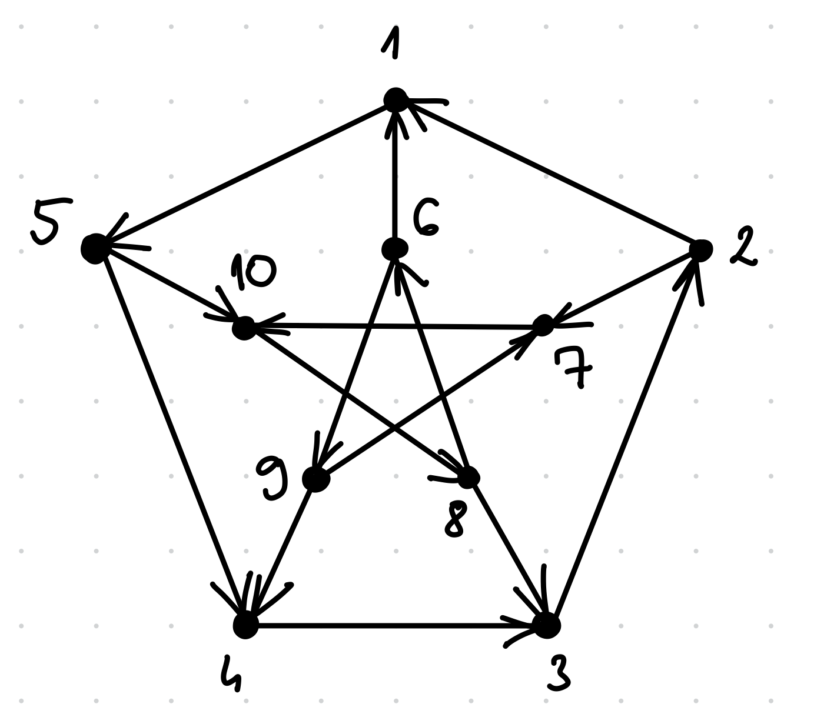

# Condorcet

Volt aki észrevette, hogy ez egy megirányított Petersen-gráf! :)



Megint sok érdekes megoldás érkezett, gyűjtöttem ezekből párat.

## Élek implementálása (általános)

(ICPC EU Championship 2025 hivatalos megoldása alapján)

Az egyik lehetséges megoldási ötlet ami általános gráfra is működik, hogy egy-egy
élet két szavazóval implementálunk. Tegyük fel, hogy az $1 \succcurlyeq 2$ sorrendet szeretnénk,
ekkor a két szavazó a következő voksokat adja le:

```
A: 1 2 3 4 ... (n-2) (n-1) n
B: n (n-1) (n-2) ... 4 3 1 2
```

Azaz az $(1 2)$ pár sorrendjét fixen tartottuk,
az összes többi pár sorrendjét megcseréltük
B-ben. Ezzel A és B szavazatai együttesen
neutrálisak az összes többi párra, egyedül
az $(1,2)$ pár sorrendjét határozzák meg.

Ez a megoldás $2m \leq 2n^2$ szavazót használ.

## Csúcsok implementálása (általános)

[csucsok_impl.cpp](./csucsok_impl.cpp)

(VProg-ra járó diákok megoldása alapján)

Ha két csúcs között nincs él akkor azt húzzuk be véletlenszerűen.

Jelölje az $i.$ csúcs be-szomszédait valamilyen tetszőleges sorrendben $B_i$, a ki-szomszdait valamilyen tetszőleges sorrendben pedig $K_i$.
Legyenek továbbá a $B_i'$ és $K_i'$ pedig a $B_i$ és $K_i$ sorrendek visszafele.

Látható, hogy a következő négy szavazó összességében neutrális az $i$-t nem tartalmazó csúcspárokra az $i$ éleit pedig megvalósítja:

```
A:  B_i    i    K_i
B:  B_i'   i    K_i'
C:   i    K_i   B_i
D:  K_i'  B_i'   i
```

Ez a megoldás $4n$ szavazót használ.

## Élszínosztályok implementálása (általános)

(Fleiner Tamás megoldása alapján)

A kapott gráf irányítatlan változatán veszünk egy minimális élszínezést. Minden színosztályhoz két szavazót rendelünk, ha a színosztály élei $v_1 \rightarrow u_1,~\dots,~v_k \rightarrow u_k$ a fedetlen csúcsok pedig $w_1,~\dots,~w_l$ akkor ezek az alábbiakat szavazzák:

$$
v_1 ~~ u_1 ~~ v_2 ~~ u_2 ~~ ... ~~ v_k ~~ u_k ~~ w_1 ~~ ... ~~ w_l\\
w_l ~~ ... ~~ w_1 ~~ v_k ~~ u_k ~~ ... ~~ v_2 ~~ u_2 ~~ v_1 ~~ u_1
$$

Ezeknek a szavazatoknak az a hatása, hogy a színosztálybeli élek mentén az történik amit a feladat gráfja előír minden más él mentén pedig döntetlen a helyzet.

Mivel a maxfokszám $(n-1)$, ezért a Vizing-tétel értelmében az élkromatikus szám legfeljebb $n$ ezért összesen $2n$ szavazót használtunk.

## Hamilton-út alapú megoldás (specifikus)

[hamut.py](./hamut.py)

(P. Ákos megoldása alapján)

Az irányítatlan Petersen-gráfban van Hamilton-út, szerencsére úgy irányítottam, hogy ebben is lehet találni, például:

```
A: 4 3 2 1 5 10 8 6 9 7
```

Legyen ez az egyik szavazat, ez megvalósít nagyon sok élet.

A hiányzó élek az $(8 3), (6,1), (9,4), (5,4), (7, 10)$. Ezeket pedig megvalósítjuk úgy, hogy felsoroljuk őket egy adott sorrendben és visszafele is, két extra szavazattal:

```
B: 8 3   6  1   9 5 4   7 10     2
C: 2     7 10   9 5 4   6  1   8 3
```

## Kör-alapú megoldás (specifikus)

(Beni megoldása alapján)

Az így megirányított Petersen-gráfban pont két körbe irányított 5 csúcsú kör van.

Egy $5$ csúcsú kört megvalósíthatunk úgy $5$ szavazóval, hogy a jó sorrend $5$ lehetséges ciklikus eltolását szavazzák. A két kört együtt $5$ szavazóval le lehet írni például így:

```
A: 5 4 3 2 1  10 8  6  9  7
B: 1 5 4 3 2  8  6  9  7 10
C: 2 1 5 4 3  6  9  7 10  8
D: 3 2 1 5 4  9  7 10  8  6
E: 4 3 2 1 5  7 10  8  6  9
```

Persze ezek a szavazatok most a Petersen-gráf küllőit nem jól sorrendezik, mindegyik él befele mutat rajtuk.

Ezért keressünk két olyan ciklikus eltolást a fentiek között,
akiket valamilyen sorrendben össze tudunk fűzni úgy, hogy megvalósítsák a küllőket, a többiek pedig szavazzanak
felváltva először az első illetve először a második körre,
így a többiek teljesen neutrálisak lesznek a két kör közötti párokra!

Például ez a szavazó jó lesz:
```
A: 2 6 1 9 5 7 10 4 8 3
```

A teljes megoldás pedig:
```
A:  2 6  1 9 5 7 10 4 8  3
B:  1 5  4 3 2 8  6 9 7 10
C: 10 8  6 9 7 5  4 3 2  1
D:  4 3  2 1 5 7 10 8 6  9
E:  9 7 10 8 6 3  2 1 5  4
```

## Véletlen mintavétel alapú megoldás (ritka gráfokra)

(Hanga és Balázs megoldásai alapján)

- Mintavételezzünk véletlenszerűen $n$ méretű permutációkat.
- Ha az aktuális permutáció a még nem kielégített élkényszerek legalább felét jól sorrendezi akkor mentsük el.
  - Kielégített egy élkényszer ha az eddig elmentett permutációk több mint fele jól sorrendezi a csúcsait.
- Ismételjük addig amíg minden kényszer kielégítetté válik.

Persze egy már kielégített élkényszert is elronthat egy új permutáció hozzáadása viszont a nem kielégítettek felét biztosan megjavítja ezért valahogy érezhető hogy ha ritka a gráf akkor ez összességében egészen jól tud működni. A konkrét input gráfra nagyon hamar találunk megoldást egy 43 illetve egy 981 szavazatszámút.
